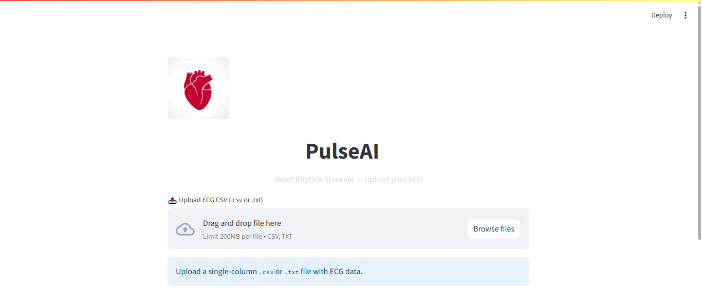

# 🫀 PulseAI — AI-Powered ECG Rhythm Screener

PulseAI is an open-source web application that enables anyone to upload an ECG signal (from `.csv` or `.txt` files) and gain instant insights into their heart rate and rhythm health. Built using **Streamlit**, **TensorFlow**, and **Scikit-learn**, PulseAI brings machine learning to personal heart health.

---

## 🚀 Features

- 📈 Upload ECG signals as `.csv` or `.txt`
- 🔍 Detect heart rhythm types (e.g., Normal, AFib, Bradycardia)
- 💓 Estimate heart rate from raw signal
- 🧠 Backed by a custom-trained CNN model
- 🌐 Web interface built with Streamlit

---

## 📸 Demo





---

## 🗂 File Structure

```

PulseAI/
├── app/
│   ├── predictor.py         # Loads and runs model predictions
│   ├── explainer.py         # Text explanation for predictions
│   ├── data\_preparation.py  # Loads + preprocesses ECG data
│   └── train\_model.py       # CNN training script
├── models/
│   ├── pulseai\_cnn.h5       # Trained model file
│   └── label\_encoder.pkl    # Label encoder for output classes
├── ui/
│   └── streamlit\_app.py     # Main UI entry point
├── notebooks/
│   └── eda.ipynb            # Optional: data analysis notebook
├── requirements.txt
└── README.md

````

---

## 📥 Sample Usage

1. **Clone the repo**

```bash
git clone https://github.com/RaviReadsCode/PulseAI.git
cd PulseAI
````

2. **Set up the environment**

```bash
python -m venv venv
venv\Scripts\activate  # On Windows
pip install -r requirements.txt
```

3. **Run the app**

```bash
streamlit run ui/streamlit_app.py
```

---

## 🧪 Input Format

Upload a `.csv` or `.txt` file with one column of ECG values (e.g., 360 values per second).

**Example:**

```
0.12
0.15
0.20
...
```

---

## ⚙️ Model Details

* Architecture: 1D CNN
* Input: 1-second ECG slices (360 values)
* Classes: Normal, AFib, Other
* Tools: TensorFlow, Keras, Scikit-learn

---

## 🛠 TODO (Planned)

* [ ] Image-based ECG rhythm detection
* [ ] User authentication (for tracking uploads)
* [ ] Streamlit Cloud / Hugging Face Space deployment
* [ ] Mobile-friendly UI

---

## 🤝 Contributing

Pull requests are welcome! If you’d like to contribute, create a fork and submit your improvements.

---

## 📄 License

This project is licensed under the [MIT License](LICENSE).

---

## ✨ Acknowledgements

* MIT-BIH Arrhythmia Dataset (PhysioNet)
* TensorFlow & Streamlit community
* Medical AI researchers worldwide

---

Made with ❤️ for health-tech innovation.
